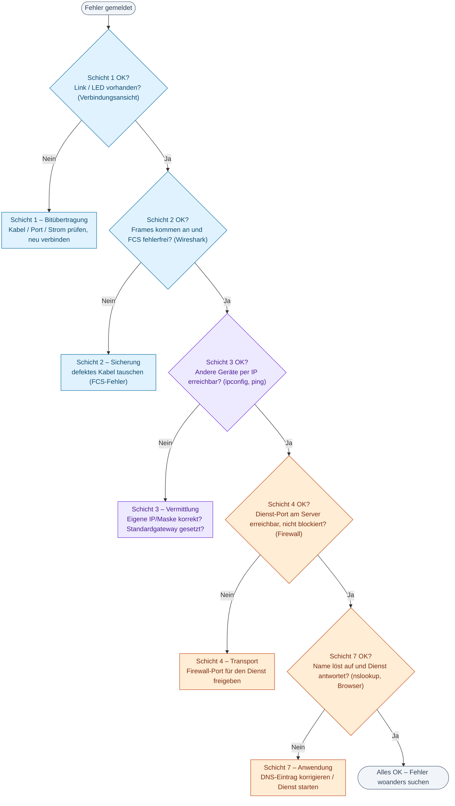
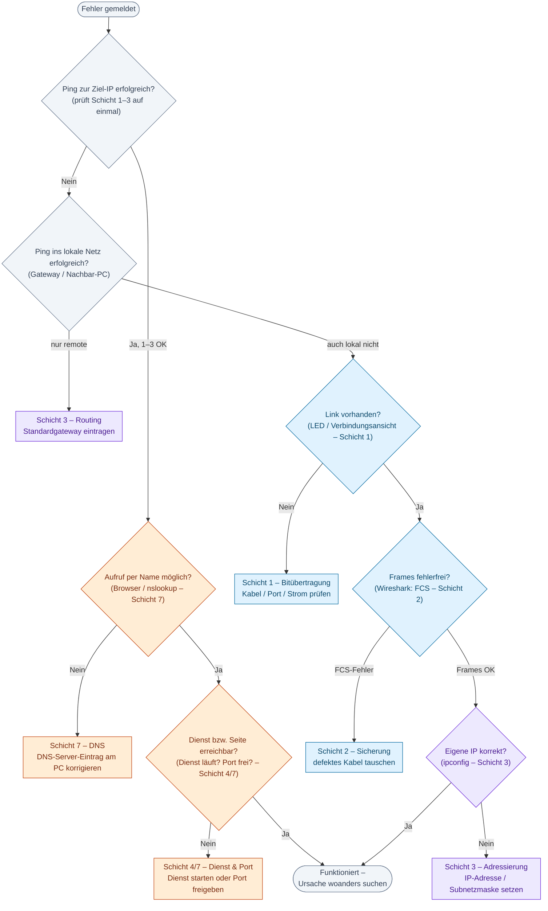

# Informationsblatt · Strukturierte Fehlersuche mit dem Schichtenmodell

## Warum Schichten?
Ein Netzwerk muss viele Teilaufgaben erfüllen – Bits übertragen, adressieren, Wege finden, Programme bedienen. Diese Aufgaben sind in **Schichten** aufgeteilt: Jede Schicht erledigt **eine** Aufgabe, nutzt die Schicht darunter und bietet der Schicht darüber einen Dienst. Das **OSI-Modell** beschreibt 7 Schichten (feine Landkarte), das **DoD-/TCP-IP-Modell** fasst sie zu 4 Gruppen zusammen (die Praxis-Sicht).

Für die **Fehlersuche** ist das Gold wert: Ein Fehler steckt fast immer in **einer** Schicht. Prüft man die Schichten **der Reihe nach**, schließt man mit einem einzigen Test oft ganze Gruppen von Ursachen aus.

## Die Schichten, ihre Aufgaben und Testwerkzeuge

| Schicht (OSI) | DoD-Gruppe | Aufgabe | Typisches Fehlerbild | Werkzeug zum Testen |
|---|---|---|---|---|
| **7 Anwendung** | Anwendung | Dienste/Programme bereitstellen (Web, DNS) | Name geht nicht / Seite lädt nicht – obwohl Ping klappt | Browser, `nslookup`, Dienststatus |
| **6 Darstellung** | Anwendung | Datenformat, Verschlüsselung | Daten unleserlich / Zertifikatfehler | (Browser-Meldung) |
| **5 Sitzung** | Anwendung | Verbindung auf-/abbauen | Verbindung bricht ab | (Protokolle/Logs) |
| **4 Transport** | Transport | Datenstrom, **Ports** (TCP/UDP) | Ping klappt, aber Dienst verweigert/blockiert | Firewall, „Port offen?" |
| **3 Vermittlung** | Internet | Adressierung & Wegwahl (IP, ICMP, **ARP**) | keine/falsche IP; remote nicht erreichbar | `ping`, `ipconfig`, `arp -a`, Wireshark |
| **2 Sicherung** | Netzzugang | Frames, MAC, Fehlererkennung (**FCS**) | Link da, aber Frames beschädigt/verworfen | Wireshark (FCS), SAT des Switch |
| **1 Bitübertragung** | Netzzugang | Bits über Kabel/Funk | kein Link; „Kabel nicht verbunden" | LED, Verbindungsansicht, `ipconfig` |

> Die Schichten **5 und 6** fasst man in der Praxis meist mit Schicht 7 zur „Anwendung" zusammen.

## So suchst du systematisch
**Grundregel:** Gehe die Schichten **von unten (1) nach oben (7)** durch. Prüfe eine Schicht – ist sie in Ordnung, steige eine höher; ist sie es nicht, hast du den Fehler gefunden. Da jede Schicht auf der darunter aufbaut, gilt: Funktioniert Schicht N, sind die Schichten 1 bis N in Ordnung.
*Nach jeder Behebung von der betroffenen Schicht aus erneut prüfen.*

### ① Standard-Weg – Schicht für Schicht (1 → 7)

*Farben: blau = Netzzugang (Schicht 1/2), violett = Internet (3), orange = Transport/Anwendung (4/7).*

### ② Bonus für Schnelle – der „Ping-Sprung"
Profis sparen Schritte. Der **Ping** testet die Schichten **1–3 mit einem einzigen Befehl**: Klappt er, kann man die unteren drei Schichten überspringen und sofort weiter oben suchen; klappt er nicht, grenzt man von dort nach unten ein.

> **Merksatz:** Klappt der Ping zu einer IP-Adresse, arbeiten die Schichten 1–3 für *diesen Weg* gerade. *Achtung:* nur „in diesem Moment" – sporadische Aussetzer schließt ein erfolgreicher Ping nicht aus.

Schneller, aber schwerer zu lesen:

*Graue Rauten = breiter Ping-Test (Schicht 1–3); farbige Elemente = eine bestimmte Schicht.*
